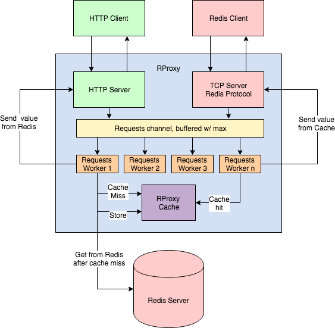

## Getting started
- Running RProxy locally w/ docker: `make run` (will build docker images before-hand)
- Testing RProxy locally w/ docker: `make test` (will build docker images before-hand)
- Build all docker images: `make build`

## Implementation
- I've implemented RPRoxy - a server that handles GET requests over both HTTP on port 9090 and the Redis Protocol over TCP on port 6379
- `cmd/rproxy/main.go` is where it all starts, with the `proxy` package for most proxy-level logic and `cache` package
- In `pkg/proxy/worker.go`, we handle generic rproxy requests (whether they're tcp/redis OR http).
- The `cache` package is built on top of Mitchell Hashimoto's LRU cache implemention `github.com/hashicorp/golang-lru`, as I did not want to reinvent the wheel. On top of this cache, I've added global expiry based on a configurable expiration and cleanup interval.
- All system tests are in `test/http_system_test.go` and `test/redis_system_test.go`
- Algorithmic complexity of the cache operations:
    - GET cache is `O(1)` time complexity, `O(1)` space complexity
    - SET cache is `O(1)` time complexity, `O(1)` space complexity
    - Cache cleanup is `O(n)` time & space complexity where `n` is the number of elements in the cache. This is optimized though because we start purging the oldest keys in the cache until we've hit a non-expired key.

## Architecture

##Time Spent
- 30 mins looking into problem and seeing available caching libraries and redis library (11p - 11:30p)
- 45 mins on project skeleton - web server, look into redis client & protocol
- 15 mins on seq concurrent processing
- 30 mins on initial parallel processing setup 
- 30 mins on adding LRU Cache library, adding in global expiry skeleton 
- 20 mins refactor and decide proxy/server pkg and struct naming 
- 40 mins Fix up parallel processing to not hang 
- 40 mins finishing up cache global expiry, manual testing with local redis
- 1hr on setting up makefile, dockerfiles, and docker-compose
- 45 mins on system tests
- 20 mins on start of redis protocol impl
- 20 mins on documentation
- 30 mins refactoring to allow for http & redis protcol
- 1.5hr finishing up redis protocol, running into weird typing issues and learning more about the redis protocol.

- total: ~8.5hrs

## Requirements implemented
- [x] HTTP web service
- [x] Single backing instance
- [x] Cached GET
- [x] Global expiry
- [x] LRU Eviction
- [x] Sequential concurrent processing
- [x] Configurations
- [x] System tests
- [x] Platform 
- [x] Single-click build and test
- [x] Documentation
- [x] Parallel concurrent processing
- [x] Redis client protocol

## What I would improve on with more time
- Add unit tests in addition to system tests
- More system test coverage
- Potentially a custom LRU Cache implementation that supports global expiry, instead of building on top of another.
- Originally I only planned on doing the HTTP implementation, but thought the TCP/Redis protocol would be fun to add. As a result, I had to refactor a little to allow for both protocols at the edge with a generic worker pattern middleware (see `pkg/proxy/worker.go`)